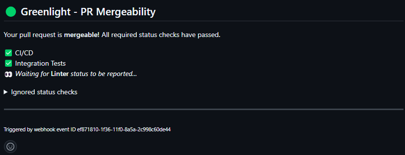

# Greenlight

`greenlight` is a tool for controlling the merge status of Github pull requests based on the results of one or more other status checks. These can be any arbitrary status checks created on the pull request, or a list of checks you explicitly define.

It is designed as an event-driven alternative to tools like [merge-gatekeeper](https://github.com/upsidr/merge-gatekeeper) which, by design, are somewhat inefficient when long-running workflows are involved.

## How It Works

`greenlight` is intended to act as the sole [required status check](https://docs.github.com/en/repositories/configuring-branches-and-merges-in-your-repository/managing-protected-branches/about-protected-branches#require-status-checks-before-merging) on the repository, and therefore the single source of truth concerning mergeability.

It monitors all other status checks on a given pull request and determines its merge status accordingly. This consolidated status is displayed via a comment indicating the state of each required status check, as well as via the `greenlight` status check that will be added to the pull request.

In turn, this status check can be marked as required via branch protection rules.



## Getting Started

`greenlight` is distributed as a single container that can be run on any number of platforms. To get started with `greenlight` locally, use `docker` and a tool like [ngrok](<https://ngrok.com/docs/getting-started/?os=linux)>) to make the local container accessible to Github webhooks.

### Prerequisites

- A Github PAT with `repo.*` permissions

### Setup

Start the `greenlight` container:

```bash
docker run -d \
  --name greenlight \
  -e GITHUB_TOKEN=$GITHUB_TOKEN \
  -p 3000:3000 \
  mrmonaghan/greenlight:latest
```

The container will need to be publicly accessible in order to recieve webhook events from Github. If you're using `ngrok`:

```
ngrok http http://localhost:3000
```

Configure a webhook on your repository with the following properties:

```
url: https://$ngrokUrl/github/webhook
content-type: application/json
events:
  statuses
  issue_comments
```

Confirm everything is working by opening a pull request that triggers a status check, or by commenting `/greenlight refresh`. Use `docker logs greenlight -f` to monitor activity.

## Deployment

`greenlight` can be deployed anywhere containers run, and simply needs to be able to recieve incoming traffic on `/github/webhook`.

A general-purpose health-check endpoint is available at `/healthz` for Kubernetes-based deployments.

## Configuration

### Configuration File

`greenlight` is configured using the `greenlight.yaml` configuration file, which supports the following options:

```yaml
status:
  strict: false
  require:
    - 'Status That Must Succeed'
  ignore:
    - 'Status I Don't Care About'

branch:
  include:
    - feat-branch-*
  exclude:
    - docs-branch-*
```

The container is packaged with a default configuration:

```
status:
  strict: false
```

This configuration will require all status checks present on the pull request to pass, but does not explicitly require or ignore any checks.

### Configuration Options

| option | description | default |
|--      |--           |--       |
| `status.require` | A list of status checks that are required to pass in for the pull request to be mergeable. If a check is present in both `status.require` and `status.ignore`, it will be ignored. | `[]` | 
| `status.ignore` | A list of status checks to ignore during evaluation. | `[]` |
| `status.strict` | When `true`, *only* required status checks will be evaluated. All other status checks will be ignored. | `false` |
| `branch.include` | A list of glob expressions the pull request branch must match in order for `greenlight` to take action. Eg: `example-branch-*` | `[]` |
| `branch.ignore` | The inverse of `branch.include`. `greenlight` will ignore any branch that matches a glob pattern in `branch.ignore`. Ignore rules are always evaluated first, meaning if a branch matches both a `branch.include` and a `branch.ignore` pattern, it will be ignored.

### Environment Variables

The following environment variables can also be used to configure `greenlight`:

| var | description | default | required? |
|--      |--           |--       |--      |
| `GITHUB_TOKEN` | The Github PAT that will be used to authenticate. Requires `repo.*` permissions. | `null` | `yes` |
| `GITHUB_WEBHOOK_SECRET` | Optional secret value used to authenticate Github webhooks. | `undefined` | `no` |
| `CONFIG_FILE` | Full path to the `greenlight.yaml` file. Technically file name is arbitrary. | `/app/greenlight.yaml` |  `no` | 